# PesoWeb + MissionCommerce AI: screen-by-screen demo

Written for: the Evo.Ninjas team and anyone who will watch or present the demo. All screenshots were taken from the running system on 2026-10-06 (PesoWeb on localhost, the AI dashboard on localhost), by a script (`ui/demo/capture.mjs`), so they can be retaken at any time.

**What is real and what is simulated.** The companies, branches and staff (Evo Quick Mart and so on) are simulated. The 493 products, their costs and their prices are the real Alma Store shelf data. The shoppers are simulated and their reaction to price is the simulator's own assumption. The AI never sees that assumption.

---

## Part A. PesoWeb: set up in this order

PesoWeb is the retail system (POS and back office). The AI is not inside it: PesoWeb enforces the rules, and the AI is a separate program that proposes changes through PesoWeb's API. Set things up from the top down, because each level depends on the one above it.

| Order | What | Where in PesoWeb | Screen |
|---|---|---|---|
| 1 | Head company settings | Setting, then App Setting | 02 |
| 2 | Sub companies (tenants) | Subscription, then Tenants | 03 |
| 3 | Branches of each company | Setting, then Branches | 06 |
| 4 | Roles and users | Setting, then Roles; People, then Users | 04, 07 |
| 5 | Products with cost and price | Inventory, then Products | 09 |
| 6 | Margin rules and approval settings | Approval Center, then Settings | 13 |
| 7 | AI settings: this company, each branch, the whole group | Intelligence Hub, AI Settings tab | 18, 19 |
| 7b | AI on and off, and Run now | AI Control | 10 |
| 8 | Day to day: approving the AI's proposals | Approval Center | 11, 12 |

### 0. Sign in

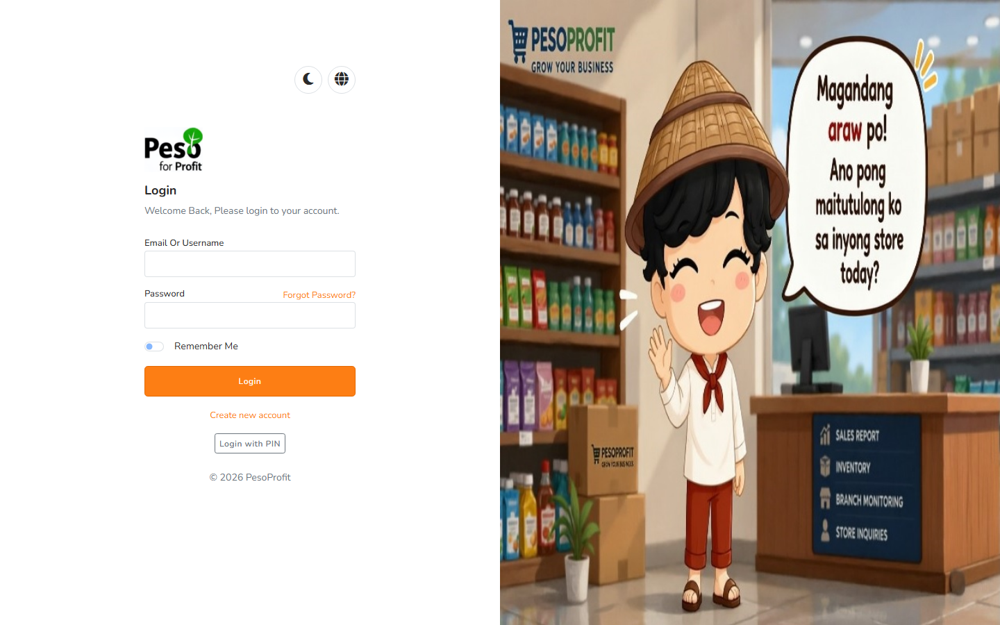

Every user signs in with an email and password. A company owner sees only their own company. The head company's administrator also sees the list of all companies.

### 1. Head company settings

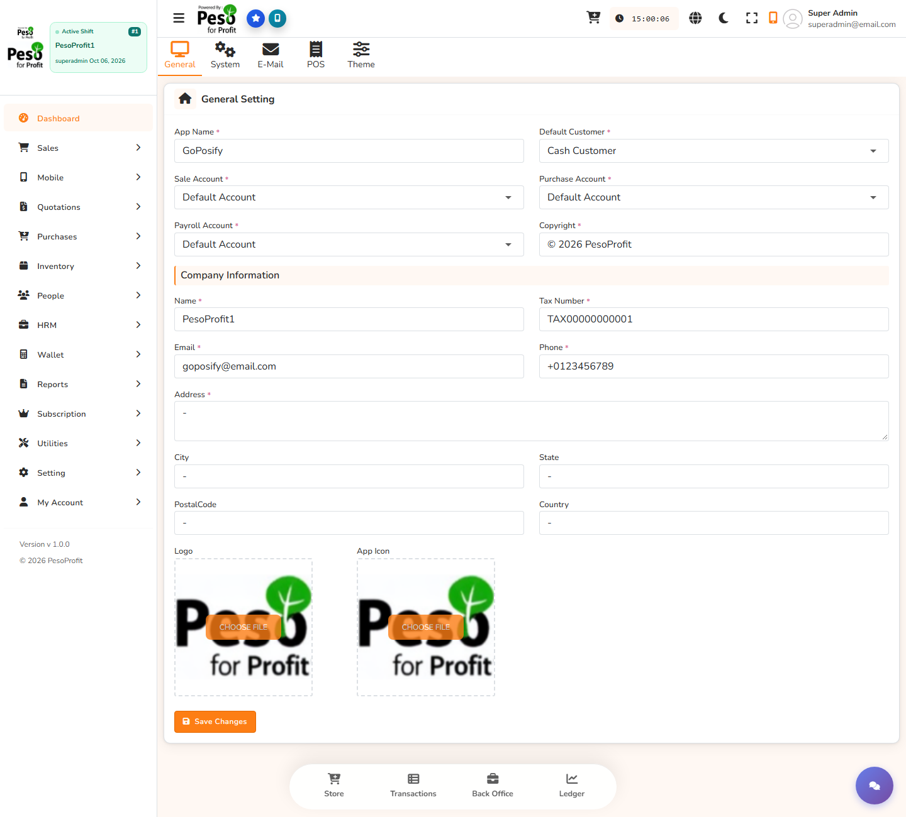

The head company is the account that runs the platform (here "PesoProfit1", tenant 1). Its General settings hold the company name, tax number, contact details and logo, plus the default accounts for sales, purchases and payroll. The other tabs (System, E-Mail, POS, Theme) hold the rest. Fill this in first, because every sub company starts from these defaults.

### 2. Sub companies (tenants)

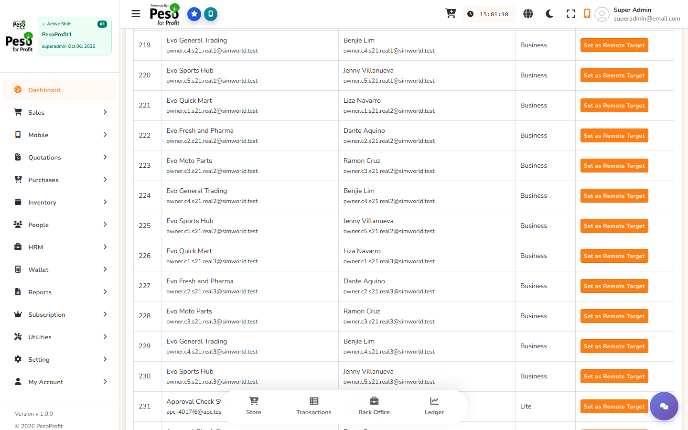

Each customer company is a **tenant**: its own products, branches, users, prices and AI settings, kept apart from every other tenant. This list is shown to the head company only. In the simulation there are five companies in the AI world (tenants 221 to 225: Quick Mart, Fresh and Pharma, Moto Parts, General Trading, Sports Hub) and five identical companies without the AI (tenants 226 to 230), so the two can be compared fairly. The login page also has a "Create new account" link for a company to register itself (not shown in the simulation, where the companies were created by script).

### 3. Branches

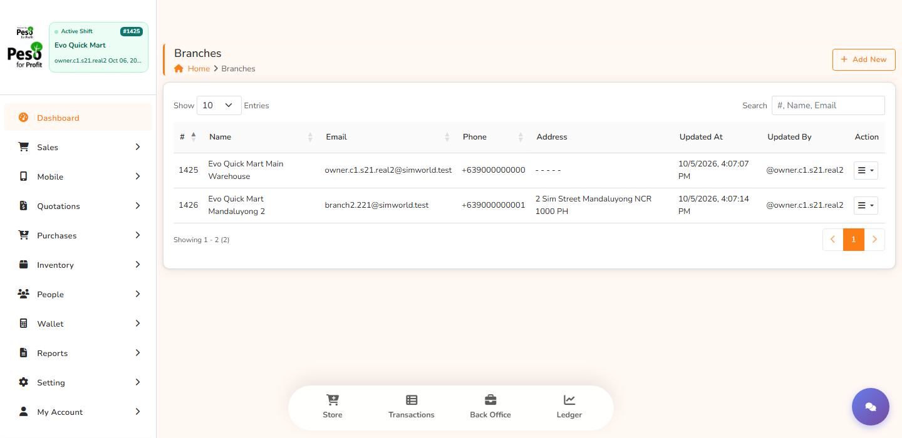

Switch to a company owner (here Evo Quick Mart). A branch is a store or warehouse. Each company has at least one; this one has two ("Main Warehouse" and "Mandaluyong 2"). Stock, sales, cash shifts and expiry are tracked per branch, while the **list price** of a product is company-wide. That distinction matters for the AI: a list-price change touches every branch, so it always needs a person.

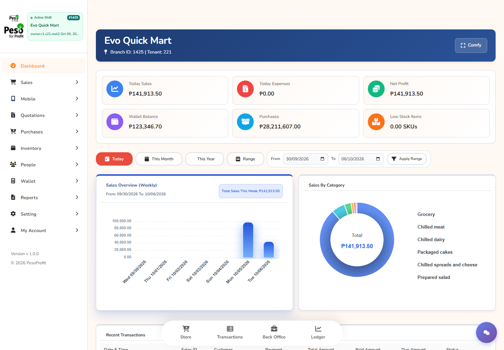

The owner's dashboard shows the day's sales, expenses, profit and low stock for the active branch.

### 4. Roles and users

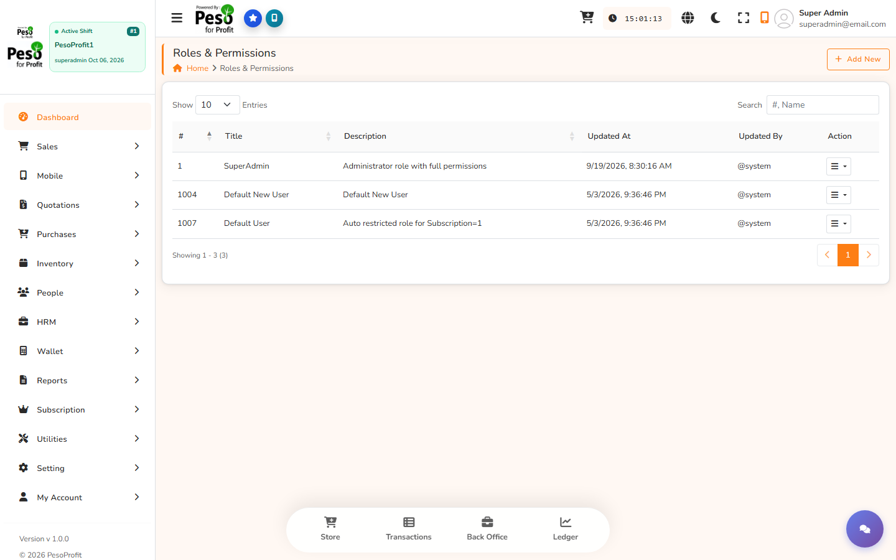

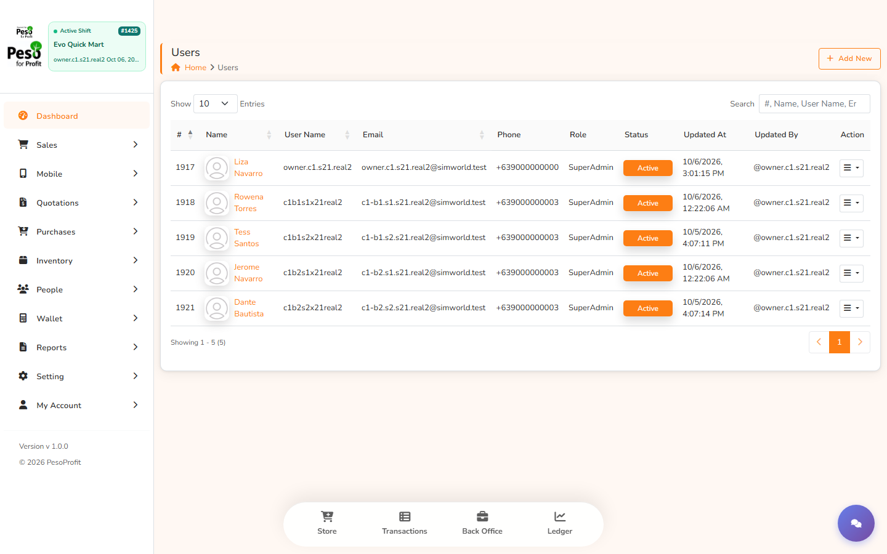

Roles decide who can do what. The owner role (SuperAdmin) has every permission. The AI features added four permissions: `AI.Control` (switch AI features on and off) and `Pricing.Approve.Store`, `Pricing.Approve.Pricing` and `Pricing.Approve.Owner` (who may approve which size of AI price change). Users are the owner and the branch staff.

### 5. Products with cost and price

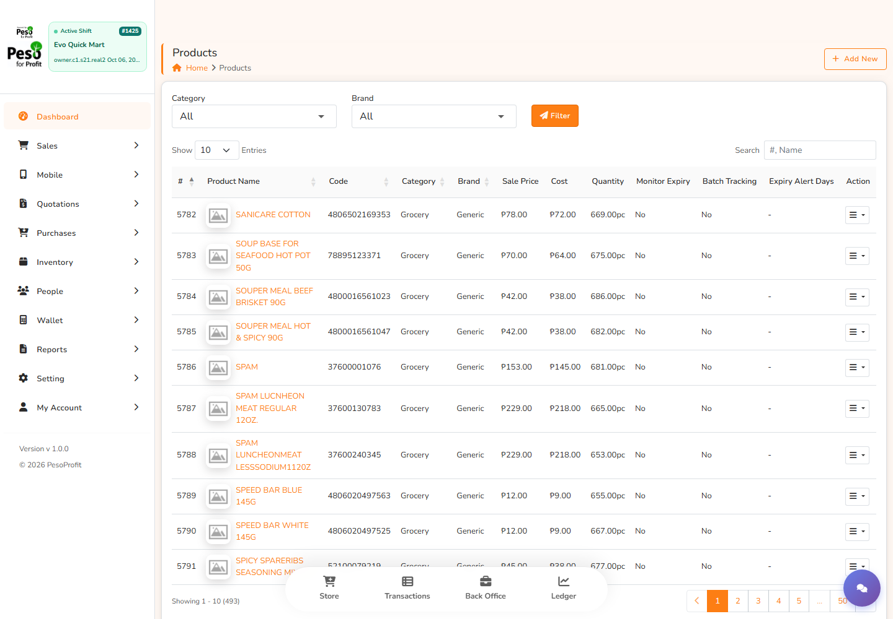

The AI can only reason about profit if it knows what each product **costs**. This screen shows cost, sale price, stock and expiry monitoring for every product (493 here). Products that go off quickly have "Monitor Expiry" on, which is what lets the AI clear stock before it expires.

### 6. Margin rules and approval settings

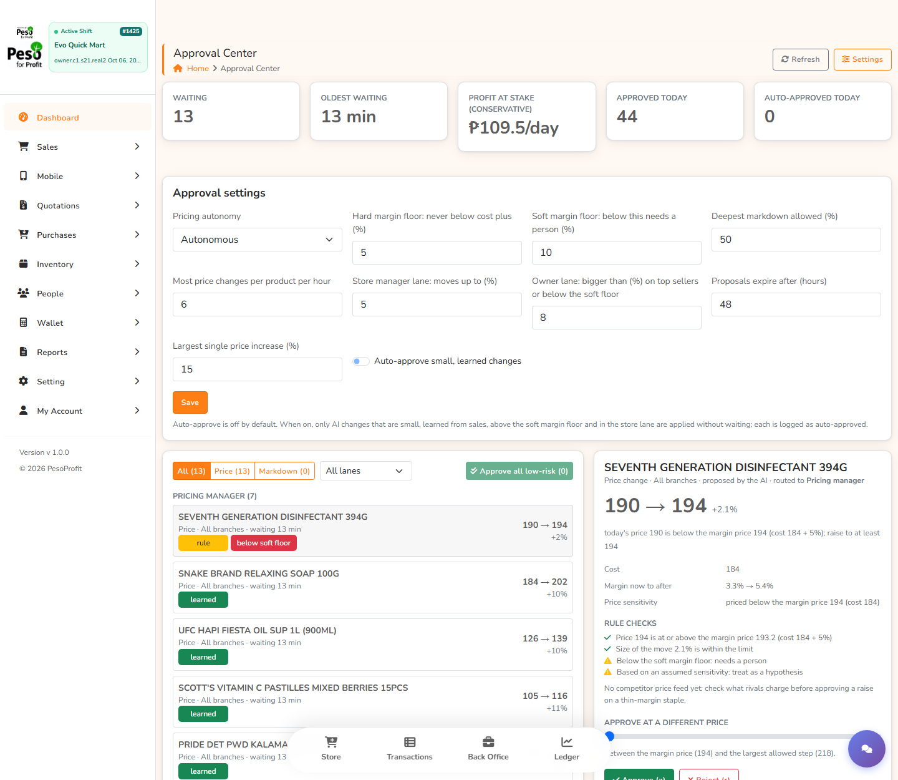

The owner sets the guardrails the AI cannot override:

- **Pricing autonomy:** Autonomous, Approval (every change waits for a person) or Off.
- **Margin floors:** the hard floor (never below cost plus a percentage, cannot be waived) and the soft floor (below it, a person must approve), plus the deepest markdown allowed and the most price changes per product per hour.
- **Lane sizes:** which size of change goes to the store manager, the pricing manager or the owner.
- **Largest single price increase** and **how long a proposal waits** before it expires.
- **Auto-approve small, learned changes:** off by default.

### 7a. The Intelligence Hub: monitoring, tasks, rules, reorders, missions and the AI settings

The **Intelligent Hub** has its own group in the left menu, right under Dashboard. It gathers everything about monitoring and the AI in one place: Overview, My tasks, Approval Center, Reorders, Customer missions, AI Impact, Alert rules, AI Control and AI Settings. Each item opens the matching screen or tab directly (so a store manager can go straight to My tasks, and an owner to AI Impact).

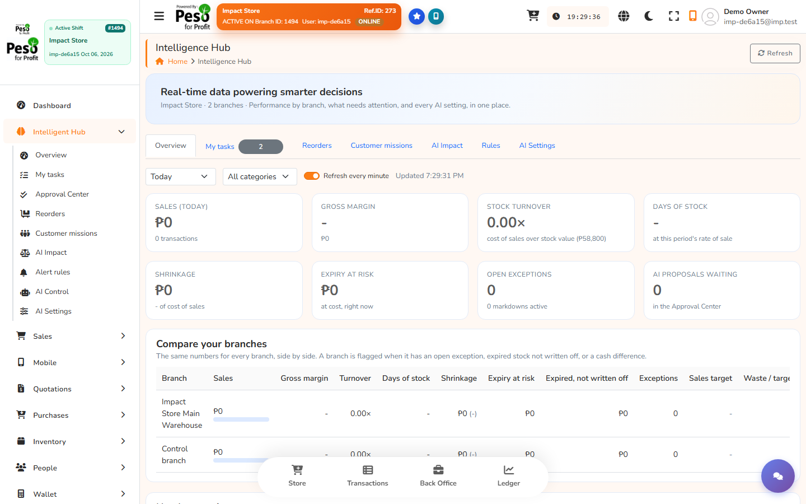

The hub page itself (Overview, My tasks, Reorders, Customer missions, AI Impact, Rules, AI Settings) is the home for monitoring and for the AI at every level. It has seven tabs.

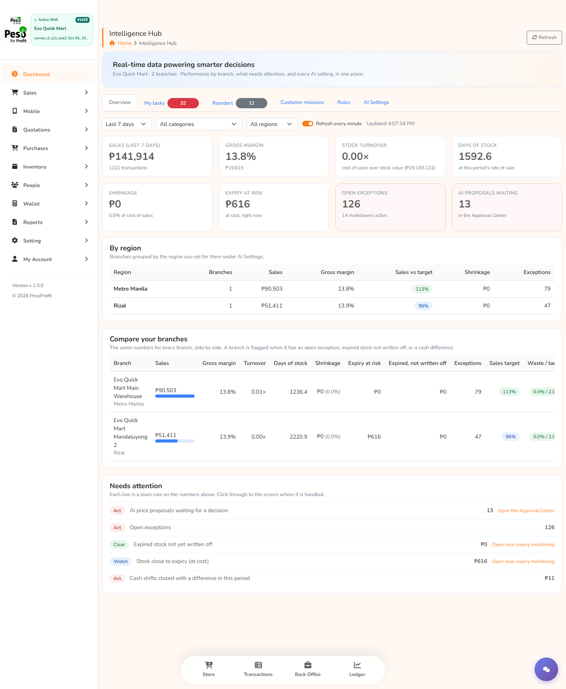

**Overview.** Pick a period (today, yesterday, last 7 days, last 30 days, this month), optionally one category and, once branches have regions, one region. Eight tiles show sales, gross margin, stock turnover, days of stock, shrinkage, expiry at risk, open exceptions and waiting AI proposals, and the page refreshes itself every minute. **By region** groups the branches (click a region to filter); **Compare your branches** shows each branch against its sales target (the percentage is sales so far against the daily target for the days elapsed) and its waste against its waste target. (On the simulated shelves the days-of-stock figure is very high because they are stocked far beyond what sells; that is the simulation, not a calculation fault.)

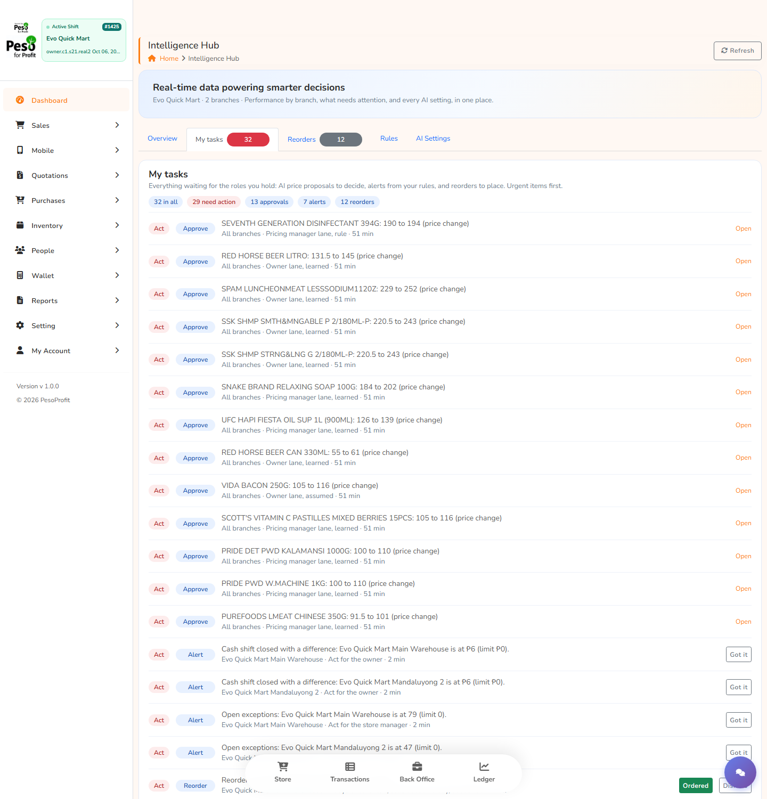

**My tasks.** Everything waiting for the roles the signed-in person holds, plus anything assigned to them by name: AI price proposals to decide, alerts from the rules, and reorders to place. Urgent items first. "Got it" acknowledges an alert (it still closes by itself when the numbers recover); "Ordered" or "Dismiss" settles a reorder.

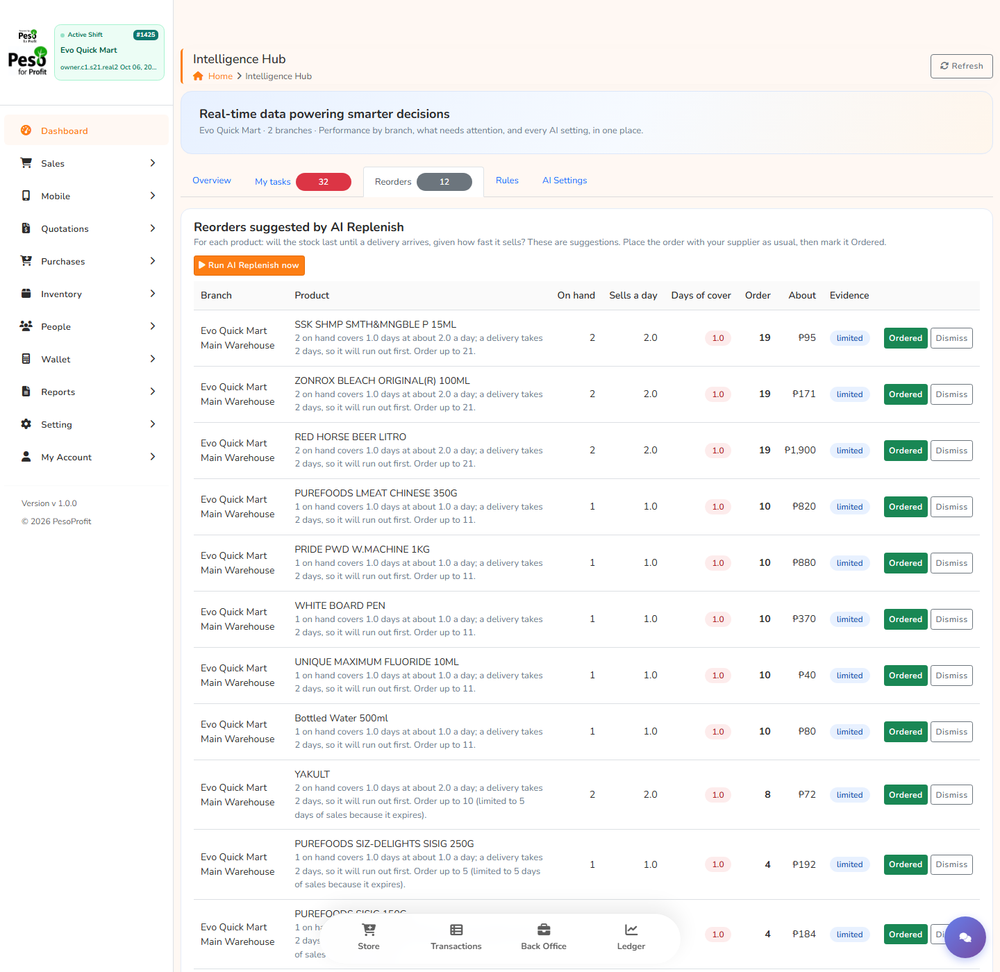

**Reorders.** AI Replenish asks, for each product, whether the stock will last until a delivery arrives. Each suggestion shows what is on hand, how fast it sells, the days of cover left, how much to order and about what it costs, and the reasoning in words. A red cover figure means the stock runs out before a delivery could arrive. Perishables are capped at what sells before they expire (see Yakult). Tick suggestions and choose **Create draft purchase order**: PesoWeb makes a **Pending** purchase order per branch and supplier (the supplier each product was last bought from), with the same accounting entry any new purchase gets, and no change to stock until it is marked Received. The green box links to the purchase. This demo scenario is staged: the fastest sellers at one branch were set down to about a day of stock.

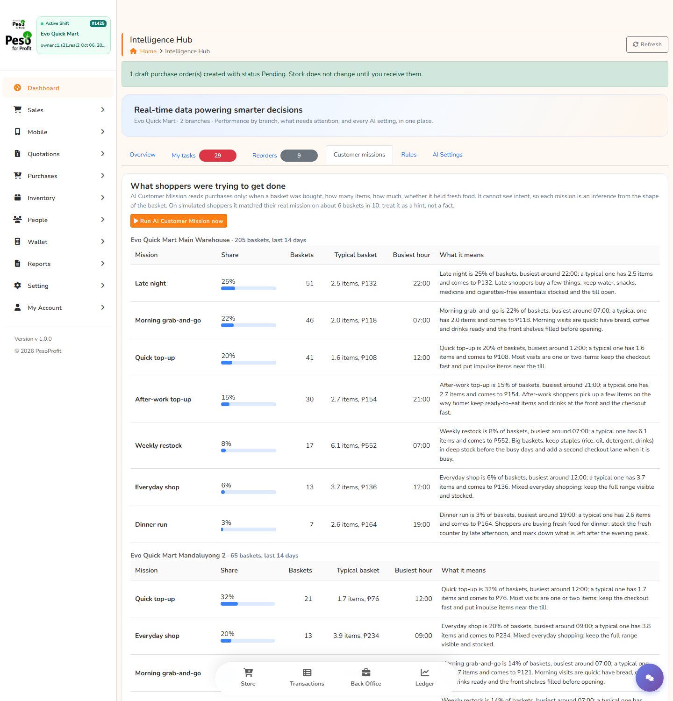

**Customer missions.** AI Customer Mission works out what shoppers were trying to get done (quick top-up, dinner run, weekly restock, late night, morning grab-and-go) from purchases only: the hour, the number of items, the value, and whether the basket held fresh food. It cannot see intent. Each mission shows its share, the typical basket, the busiest hour, and what it means for stock and staffing. On simulated shoppers it matched their real mission on about 6 baskets in 10 (59%), weakest where an evening quick stop looks just like an after-work top-up, so treat it as a hint.

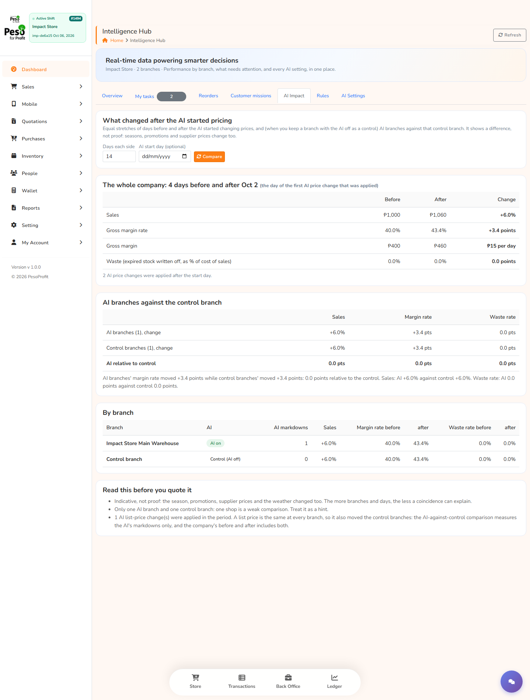

**AI Impact.** Did the AI make a difference? This tab compares equal stretches of days before and after the day the AI started changing prices (by default the day of the first applied AI price change; you can pick the day and the number of days each side): sales, gross margin rate, gross margin per day, and waste. Below it, **AI branches against the control branch**: keep one similar branch with AI markdowns switched off (AI Settings) and the others on, and the tab shows how each group moved and the difference between them, which removes most of the season and holiday noise. The page always carries a "read this before you quote it" box. One thing it will not let you overclaim: a list price is the same at every branch, so a list-price change moves the control branch as well; the AI-against-control comparison therefore counts the AI's **markdowns** only, and the screenshot above shows exactly that case (the company's margin rate is up 3.4 points, but the AI branch and the control moved together, so the AI is credited with 0.0 points relative to the control). The numbers in the screenshot are a throwaway test shop with dated-back sales, not real results; the simulated twin-world comparison (AI ahead on 10 of 10 days) is in `Docs/showcase-results.md`.

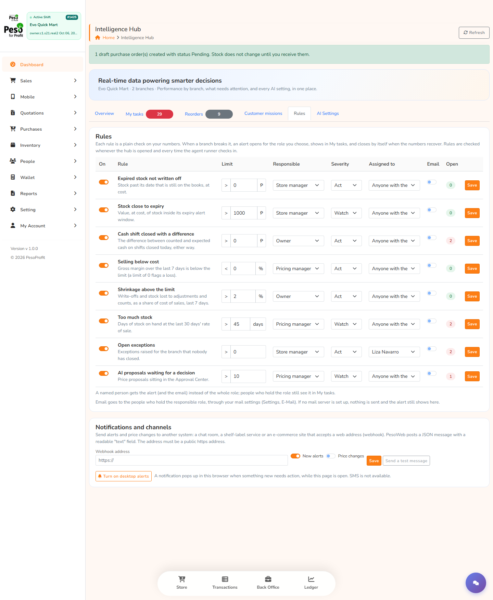

**Rules.** Nine rules: eight measured by PesoWeb (expired stock not written off, stock close to expiry, cash shift closed with a difference, selling below cost, shrinkage, too much stock, open exceptions, AI proposals waiting) and one fed by AI Monitoring ("Unusual activity found by AI", which has no limit to set). For each: switch it on or off, set the limit, choose the responsible role, the severity, and optionally **a named person** (who then gets the alert and the email instead of the whole role), and whether to also email. PesoWeb checks the rules itself every few minutes (and when the hub opens, and when the agent runner checks in), so alerts open without anyone looking. **Notifications and channels** lets a company send alerts and price changes to another system through a webhook (a chat room, a shelf-label service, an e-commerce site): public https addresses only, with a test message, and a switch for browser desktop alerts. SMS is not available.

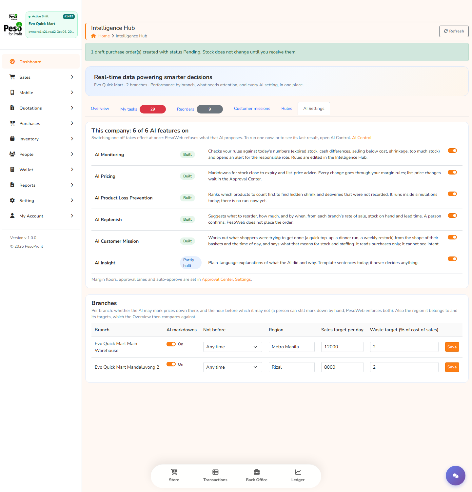

**AI Settings.** The settings at each level:

- **This company:** the six AI features, each with a switch (enforced by PesoWeb), and a link to the margin rules in the Approval Center.
- **Each branch:** whether the AI may mark prices down there and the hour before which it may not (PesoWeb enforces both on AI markdowns; a person can still mark down by hand), the **region** the branch belongs to, and its **sales target per day** and **waste target**.

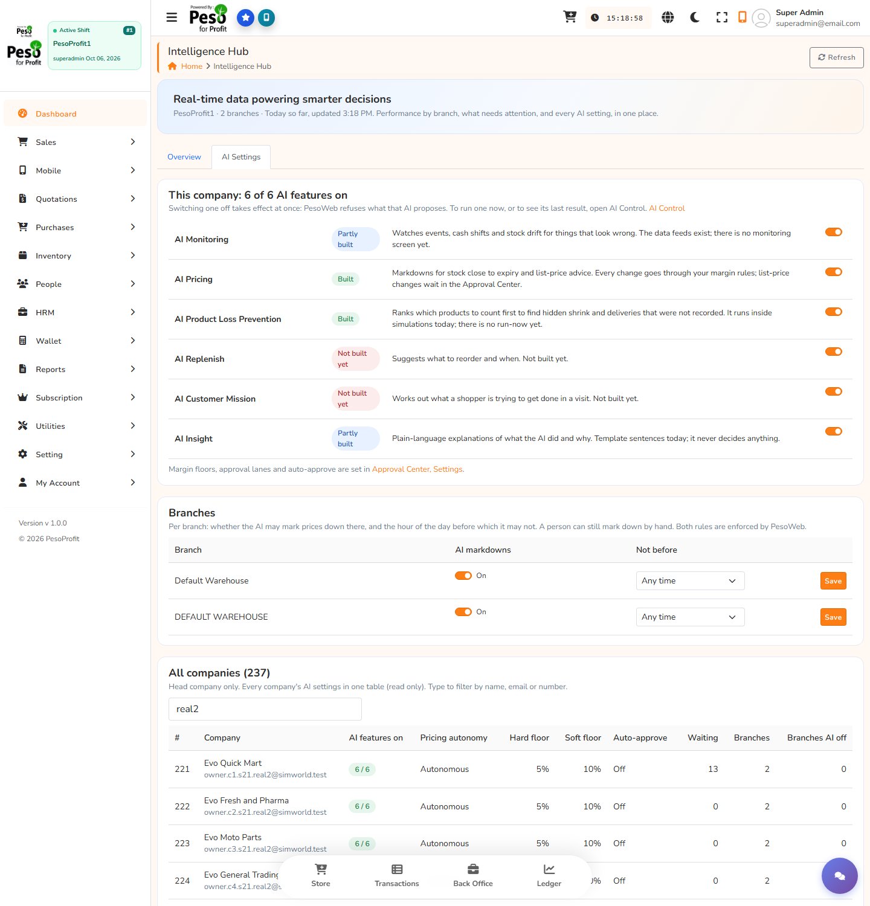

- **The head company:** a read-only table of every company's AI features, pricing autonomy, margin floors, auto-approve, waiting approvals and branch count, with a filter. A company owner does not see this section.

**AI Monitoring (run now).** On the AI Control page, AI Monitoring has a **Run now** button. Besides checking the rules, it compares each branch with its own recent past and flags what is out of the ordinary: a day when sales fell by half (or doubled), one cash difference far above the shop's usual, a cashier short again and again, a burst of returned or deleted sales, stock on the shelf that no longer equals the stock ledger. Each finding says what was seen and against what, never who is to blame, and arrives as an alert for the Owner (change the role, severity or named person in Rules). It needs a week or so of history before it judges sales.

### 7b. Switching the AI on and off, and Run now

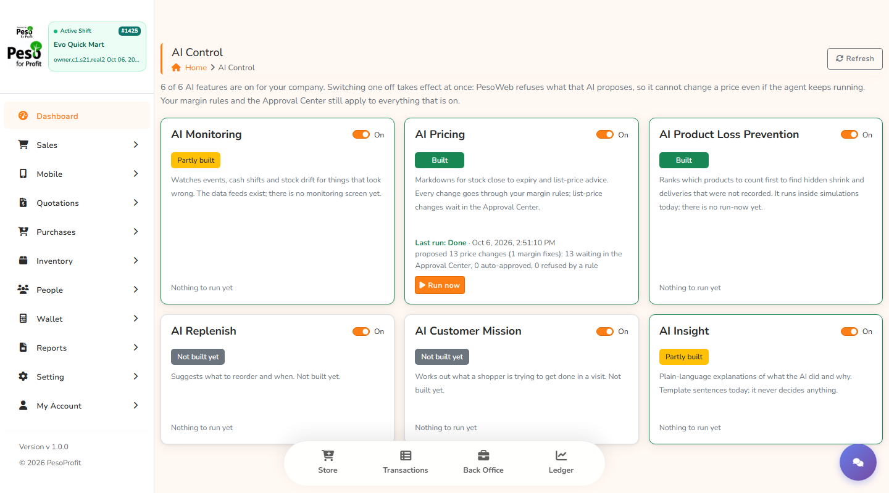

AI Control lists the six AI features, whether each is built, and a switch for each. Switching AI Pricing off takes effect at once: PesoWeb refuses what that AI proposes, even if the agent keeps running. **Run now** asks the agent to run (the agent is a separate program, and the card shows the result of the last run). Only AI Pricing can run today. Replenish and Customer Mission are shown as "Not built yet", on purpose, so nobody thinks they work.

### 8. Approving the AI's proposals

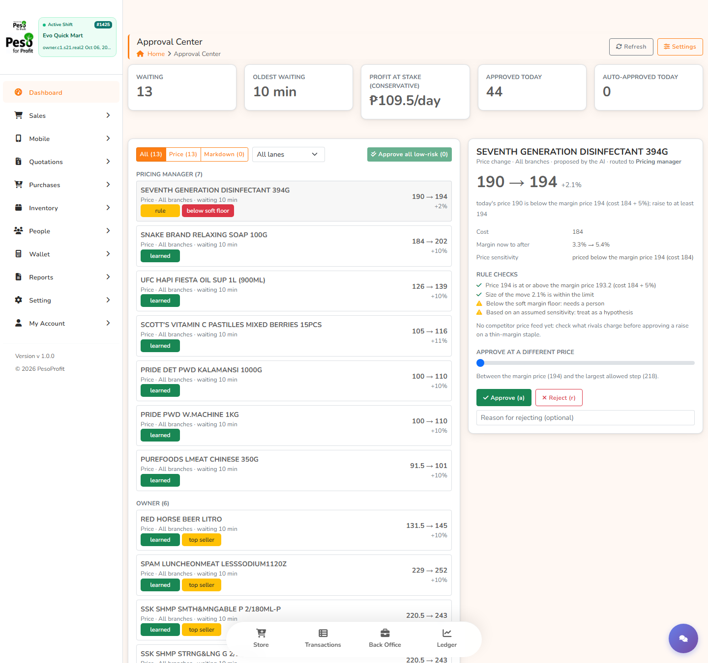

The Approval Center is one inbox for every price change that needs a person. Proposals are sorted into lanes by size and risk (pricing manager, owner, store manager). The counters show how many are waiting, how long the oldest has waited, the profit at stake, and how many were approved today.

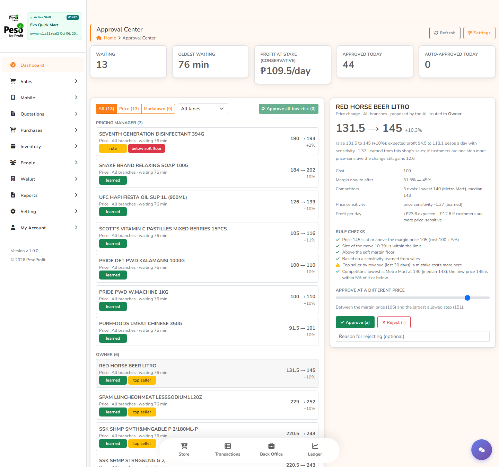

Select a proposal to see why. This one is a +10% raise on a top-selling beer. The panel shows the cost, the margin before and after, **what rivals charge** (lowest, median, and a check that flags a raise more than 5% above the lowest), the price sensitivity the AI learned from this shop's own sales, the expected profit and the conservative profit if customers are more price-sensitive, and the rule checks (one amber warning: top sellers go to the owner). The rival prices here are a simulated feed; a real company enters them, imports them, or feeds them from a monitoring service. The person can approve, reject, or **approve at a different price** with the slider. Everything is logged.

---

## Part B. The AI dashboard (MissionCommerce AI results)

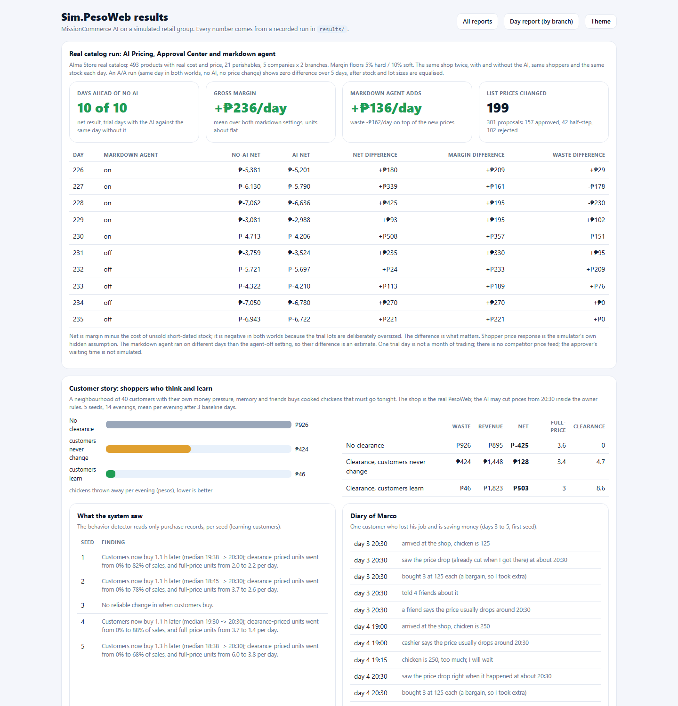

The AI dashboard shows recorded runs of the AI against the real PesoWeb. The top card is the run on the real catalog: the AI Pricing flow (proposals into the Approval Center, a simulated approver, then the markdown agent), compared day by day with the same shop without the AI. After the two shops were made truly identical (stock and lot sizes equalised, and checked with a no-AI run that showed zero difference), the AI ended ahead on all 10 trial days: gross margin about +236 pesos a day, and the markdown agent adding about +136 pesos a day on top, mostly by cutting waste. The effect is small, and the card says so.

Below it are the earlier results: the customer story (shoppers who learn when the price drops), the three-way proof (no markdown, a fixed rule, the AI agent; waste about 59% lower than doing nothing across five seeds), what the system caught and missed, and the Quick Sim scale test.

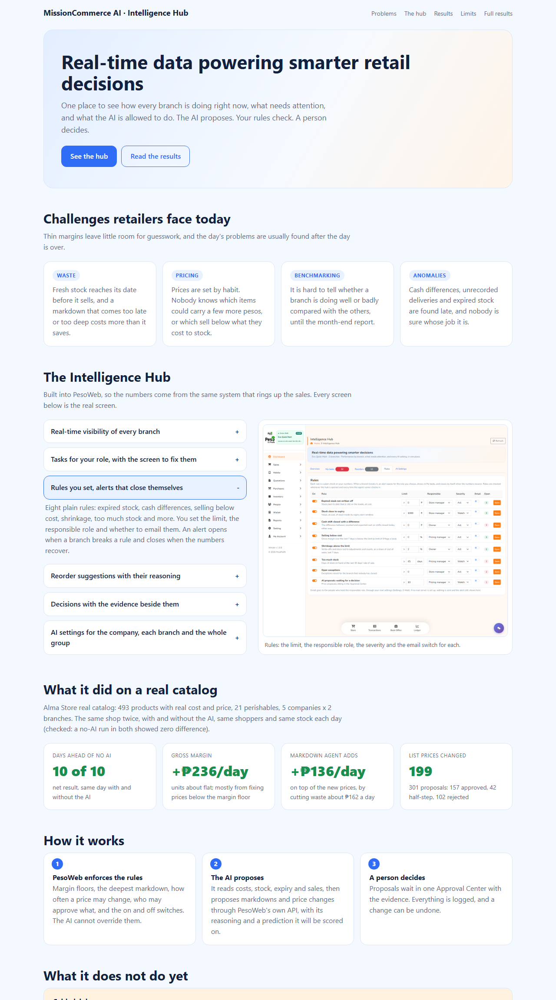

There is also a one-page explainer in the style of a retail data hub's product page: the four problems retailers face, the five capabilities with screenshots of the real screens, the live results from the real-catalog run, and the honest limits. Open `ui/hub/index.html` through the dashboard server (`http://127.0.0.1:8080/ui/hub/index.html`). Design notes and what was learned from DMALL's Data Intelligence Hub are in `Docs/intelligent-hub-design.md`.

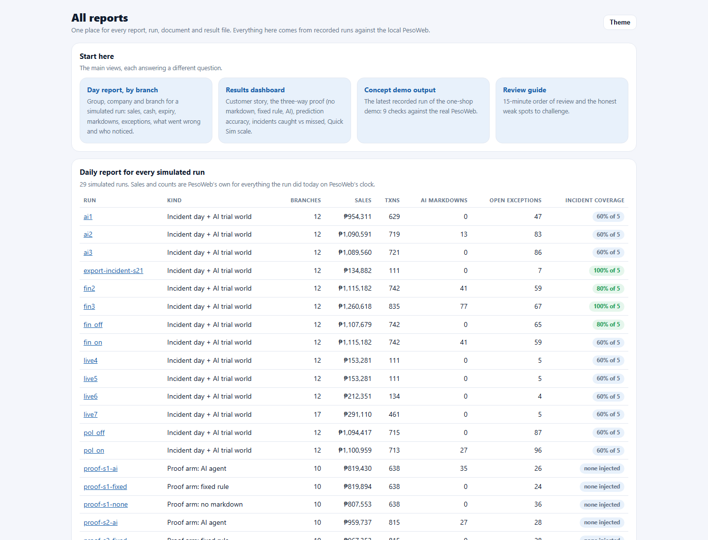

"All reports" lists every simulated run with its sales, number of AI markdowns, open exceptions and how many of the injected incidents the AI caught.

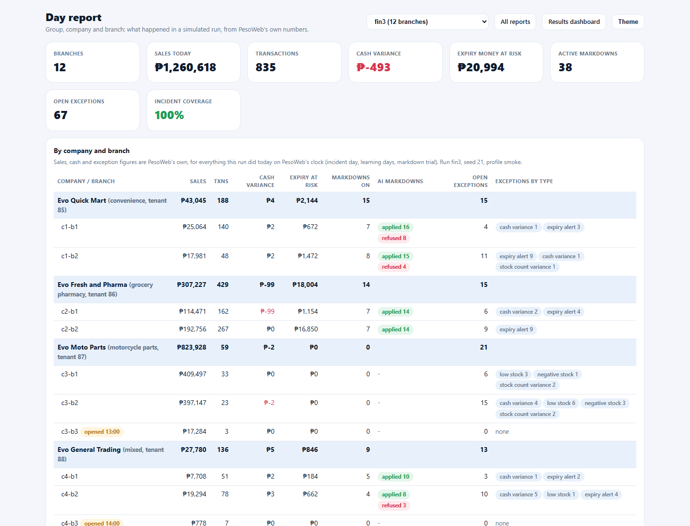

The day report breaks one run down by group, company and branch: sales, cash, markdowns, exceptions, what went wrong and who noticed.

---

## Part C. Starting the simulation

The simulation is a separate Python program (in `sim/`) that plays the shoppers, cashiers and staff through PesoWeb's real API. PesoWeb must be running first (`ui\demo\start-demo.ps1`, Part A). All commands below run from the `sim` folder:

```powershell
cd D:\git\AMD\hackathon_amd_act3\MissionCommerceAI_by_eVo.Ninjas\sim
```

**1. Run one business day in a world that already exists** (the usual way to put live data on the Overview, My tasks and AI Impact screens):

```powershell
python -m simpeso.runner day --run real2 --day 400 --datasets simulated-rules
```

- `--run` is the world: `real2` is the demo company with the AI on, `real3` the same shop with the AI off (the control), `real1` has no AI setup; `ai1`, `ai2` and `ai3` are small generated worlds (the same command on `ai3` took 3 seconds and produced 76 sales).
- `--datasets` is **required**: every test must say which customer data set(s) the shoppers come from (see "Choosing the customer data set" below). Run without it in a terminal and you are shown a menu and asked.
- `--day` is any number you have not used before for that world. It only picks the dice, so the same number replays the same shoppers; use a new number each time (the showcase used 201 to 213, so start at 400). PesoWeb itself stamps sales with the real clock, so they appear as today's sales.
- Some sales fail with "Insufficient FEFO stock": that is PesoWeb refusing to sell stock it does not have, and it is counted, not hidden.
- It prints sales, units, revenue, cost, returns, refusals and how many incidents were planted (expired stock not written off, cash differences, and so on) for the AI to find.

**1b. Choosing the customer data set (one, or a mix)**

Every test must name where its shoppers come from. There is no silent default. See what is available, and what is missing, with:

```powershell
python -m simpeso.datasets
```

| Data set | What it is | Used for |
|---|---|---|
| `simulated-rules` | Our rule-based pretend shoppers | business days (always available) |
| `hero-llm` | A few shoppers whose choices come from an AI API | the customer-story test |
| `store-pos` | Receipts exported from a real store | business days (baskets replayed), demand check, mission check |
| `instacart` | Public grocery baskets (about 3 million orders) | business days |
| `dunnhumby` | Public supermarket history with promotions | business days, demand check |
| `m5`, `favorita` | Public daily sales (and prices or promotions) | demand check |
| `till-survey` | Real shoppers' answers to "why did you come today?" | mission check |

**Real receipts straight from PesoWeb's own sales tables** (no export from another system needed):

```powershell
python scripts\export_receipts.py --tenant 6        # company 6 from PesoWeb_MissionDev; add --database PesoWeb_V2_Real for the other copy
```

It reads (SELECT only) the completed sales of one company and writes `sim\customer_data\store-pos
eceipts.csv`: an anonymous receipt id, date and time, product code, quantity, price and category. No customer, cashier, name, phone or payment detail is exported. Today the real companies hold little: 520 Minimart (company 6) has 50 completed receipts over 14 trading days (119 lines, 39 products, mostly sold between 10 PM and 1 AM), which is enough to replay real basket shapes but not enough for the demand check (that needs at least 40 days of history per product and visible price changes). More real sales, or a public data set, will fix that.

Real files go in `sim\customer_data\<id>\` (git-ignored; check each licence, and keep personal data out). Choose one, or a mix with weights:

```powershell
python -m simpeso.runner day --run real2 --day 401 --datasets store-pos:0.6,simulated-rules:0.4
```

For every visit one source is picked by those weights (the same run always repeats), and that source supplies the basket. A real data set's items are mapped onto the shop's catalog so that every product gets an equal share of purchases, most-bought first; basket sizes, quantities and which items travel together are real, the products are the shop's own. The shopper's reaction to the shop's prices stays the simulator's assumption (real baskets were bought at someone else's prices), and the result says which data sets were used (`datasets` in the day's output and `sim\runs\<run>\datasets.json`).

Checking our models against real shoppers (also needs a choice):

```powershell
python -m simpeso.validate demand   --datasets dunnhumby          # does the price-aware demand model beat price-blind baselines on days it has not seen?
python -m simpeso.validate missions --datasets till-survey        # does AI Customer Mission agree with what shoppers said? (needs store-pos receipts too)
```

The demand check fits on the first 70% of each product's history, predicts the last 30%, and reports the error against the average, the recent average and the same weekday last week, separately for the days the price moved. If the price-aware model does not clearly win (at least 2% lower error), it says so.

**2. Let the AI work on it** (needs the agent runner; start it once in a second window and leave it running):

```powershell
python -m simpeso.agent_service --run real2 --company c1 --interval 30
```

Then in PesoWeb, Intelligent Hub, AI Control: **Run now** on AI Pricing, AI Replenish, AI Customer Mission and AI Monitoring. Price proposals appear in the Approval Center; alerts and reorders in My tasks; Rules alerts open by themselves. In a demo you decide the waiting proposals yourself in the Approval Center; the simulated approver (`simpeso/approver.py`, a virtual store manager) is used only inside the showcase script in step 3.

**2b. Shoppers whose judgement comes from an AI API (optional "hero shoppers")**

```powershell
python -m simpeso.story --arm learning --days 6 --seed 3 --datasets hero-llm,simulated-rules --llm stub     # no key, offline stand-in
$env:ANTHROPIC_API_KEY = "<your key, typed in this window only>"                     # or LLM_BASE_URL + LLM_MODEL for a vLLM / OpenAI-compatible server
python -m simpeso.story --arm learning --days 6 --seed 3 --datasets hero-llm,simulated-rules --heroes 4     # real AI API
```

Four shoppers get a persona and a mission and the model chooses what they do each step; the rest of the neighbourhood stays rule-based. The key is read from the environment and never saved. Only the synthetic persona and what a shopper could see are sent. Answers are cached, so a repeat run is free, and `--max-llm-calls` caps the spend. Details and limits: `Docs/customer-actors.md`, section 5.

**3. The AI against no AI, side by side (the controlled evidence)**

```powershell
$env:PESOWEB_ROOT_PASSWORD = "<the root password, never saved to a file>"
python scripts\showcase_preflight.py --run real2                       # read-only: are prices still the catalog's?
python scriptsa_check.py --run-a real2 --run-b real3 --days 214-216  # the twins must show no difference with no AI
python scripts\showcase.py --ai-run real2 --base-run real3 --day 201   # the flow with the AI, and the same day without it
python scripts\showcase_days.py --days-on 204-208 --days-off 209-213   # more days, to average out the noise
```

Results are written to `sim/runs/showcase*.md` and summarised in `Docs/showcase-results.md`. Run the A/A check first: if the twins are not equal, any comparison is biased.

**4. Build a brand-new simulated world** (a new head company with five subsidiaries, branches, staff, products and customers, created through PesoWeb's own API; needs the root login to raise each subsidiary's plan):

```powershell
$env:PESOWEB_ROOT_PASSWORD = "<the root password>"
python -m simpeso.runner build --seed 21 --profile smoke --run myworld --policy autonomous
python -m simpeso.runner day   --run myworld --day 0 --datasets simulated-rules
python -m simpeso.runner score --run myworld        # how many planted incidents were found, missed or wrongly flagged
```

`--profile smoke` is 2 branches per company, `--profile starter` 4. Logins for every company are written to `sim/runs/myworld/world.json` and `sim/runs/CREDENTIALS.txt` (both git-ignored). Building a world adds a lot of rows to the development database, so use a throwaway name.

**5. Without PesoWeb at all** (the aggregated lane, 200,000 shoppers for 28 days; runs on a laptop CPU and later on the AMD GPU): `python -m simpeso.quicksim --device auto`.

**Stopping it:** each command ends by itself; stop the agent runner with Ctrl+C. A day of simulated sales cannot be un-sold: to reset, restore the database backup (recipe in `pesoweb-additions/README.md`, "Live verification environment").

## Part D. Test snapshots: save the database, restore it, start again from the initial data

Running the simulation changes the database. Snapshots let you get back to a known state without rebuilding anything.

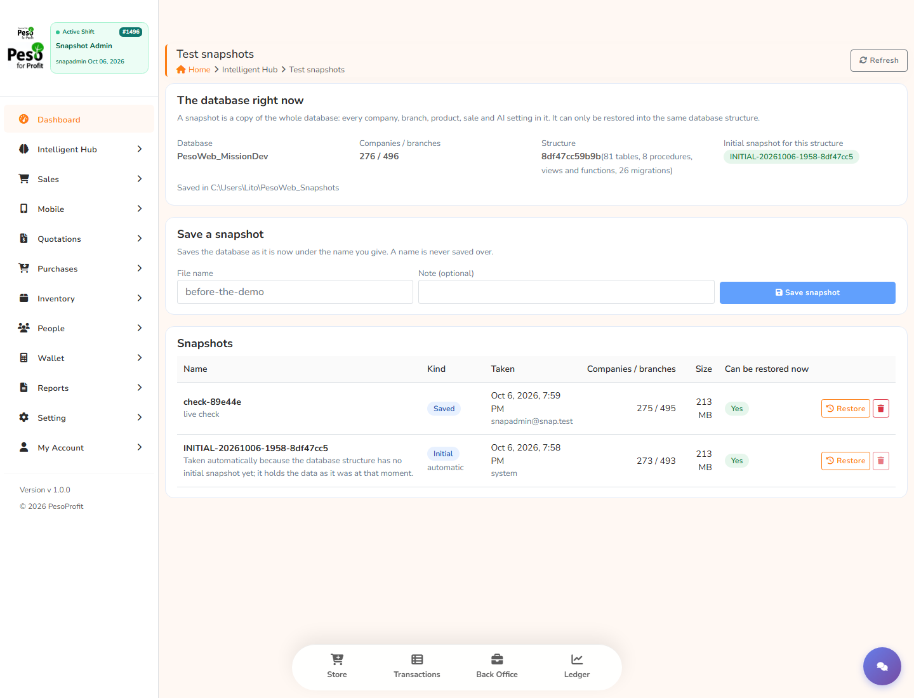

**Where:** Intelligent Hub, then **Test snapshots** (last item of the group). It is shown only when you are signed in as the **head super admin** (`superadmin@email.com`), because a snapshot is a copy of the whole database: every company, branch, product, sale and AI setting. It works only where the server has `Snapshots__Enabled=true`; `ui\demo\start-demo.ps1` sets that for the demo, and everywhere else the feature does not exist (the page says so).

- **Initial snapshot.** For the current database structure there is always one initial snapshot, the default starting point (name `INITIAL-<date>-<structure id>`). If the structure has no initial snapshot yet, PesoWeb makes one by itself about 20 seconds after it starts, from the data as it is at that moment, and the page offers **Make the current data the initial snapshot** if you want to set it by hand. An initial snapshot cannot be deleted from the page.
- **Save.** Type a file name (and an optional note) and press **Save snapshot**. The whole database is copied to `C:\Users\<you>\PesoWeb_Snapshots` (about 210 MB each for the current demo database). A name is never saved over, and only letters, digits, spaces, dots, dashes and underscores are accepted.
- **Restore.** Press **Restore** on a snapshot and type `RESTORE`. First PesoWeb saves a **safety snapshot** (`before-restore-<time>`) of the database as it is now, so a restore can itself be undone; then it checks the file, replaces the database, and checks the structure came back as recorded. Everything saved since the snapshot, for every company, is gone.
- **The structure guard.** A snapshot can only be restored into the database structure it was taken from. PesoWeb records, with every snapshot, a fingerprint of the tables, columns, indexes, constraints, views, **stored procedures**, functions, triggers and the list of applied migrations. If any of that differs now, the snapshot shows **Can be restored now: No** with the reason (for example "2 migration(s) were applied since", or "stored procedures ... differ"), and the restore is refused. Old snapshots stay on disk but become unrestorable; use a snapshot taken after the change.
- **After you change the database.** Apply the migration or script, restart PesoWeb: with no initial snapshot for the new structure it creates one. Clean the data first if you want the initial snapshot to be clean (see the note below).

**Not covered:** snapshots are for the test and demo database only. They do not replace PesoWeb's own Database Backup utility, which is per company. They are not meant for production and are off unless `Snapshots__Enabled` is set.

**Note on the first initial snapshot.** The demo database has accumulated throwaway test companies from the checks. The automatic initial snapshot (`INITIAL-20261006-1958-...`) contains all of them (about 276 companies and 496 branches). If you want a clean starting point, remove the throwaway companies first, then press **Make the current data the initial snapshot**.

## Suggested 6-minute demo order

1. **Login** and the head company (screens 01, 02): "this is the platform, and these are the defaults" (45 seconds).
2. **Tenants** (03): "each company is separate; here are five with the AI and five without" (45 seconds).
3. **One company** (06, 05, 09): branches, then products with cost (60 seconds).
4. **Rules and switches** (13, 10): "the owner sets the limits and can switch the AI off" (60 seconds).
5. **Approval Center** (11, 12): approve one proposal live (90 seconds).
6. **AI dashboard** (14): the real-catalog card and the three-way proof, with the honest caveats (90 seconds).

## Be ready to say plainly

- The shoppers and their price reaction are simulated; the real part is the catalog, PesoWeb and the AI's decisions through its API.
- On your thin real margins the benefit is a few percent of gross margin, not a transformation. The bigger waste reduction (about 59%) is on generated shops with normal margins.
- The AI is not tested on the AMD GPU yet. That test comes last, when everything else is ready.
- Not built yet: AI Replenish, AI Customer Mission, a competitor price feed.

## How to retake the screenshots

```
# start PesoWeb (5071), the Angular app (4200) and the dashboard (8080), then:
node ui/demo/capture.mjs <shots.json> Docs/demo/screens
```

`ui/demo/capture.mjs` drives a headless Chrome through the real login page. Logins are in `sim/runs/CREDENTIALS.txt` (not in git). The tool needs no downloads: Node 22 and the Chrome already installed.
